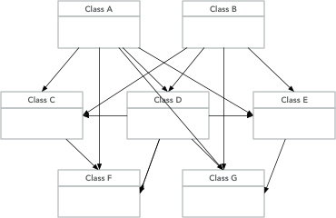
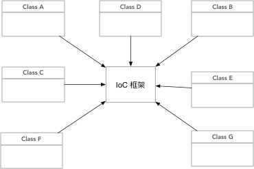

## 简单的 IoC 实现

### 什么是 IoC

IoC 是 Inversion of Control 的缩写，我们称之控制反转。控制反转是面向对象编程中的一种设计原则，可以用来降低代码之间的耦合度。其中最常见的方式叫依赖注入 (Dependency Injection, 简称 DI)。 

### IoC 的作用

在引入 IoC 之前，类与类之间的的引用通常在代码中通过 new 操作符来实例化一个类对象，比如需要在 Class A中调用 Class B 的方法，则会在 Class A 中 new ClassB()，获取 Class B 的实例后，再调用相关方法。当我们的项目越来越大，类就会越来越多，类与类之间的引用就会成指数级的增长。



引入 IoC 框架后，类之间的关系都由 IoC 框架负责维护类，同时将类注入到需要的类中。也就是类的使用者只负责使用，而不负责维护。把专业的事情交给专业的框架来完成。大大的减少开发的复杂度。



用一个类比来理解这个问题。IoC 框架就是我们生活中的房屋中介，首先中介会收集市场上的房源，分别和各个房源的房东建立联系。当我们需要租房的时候，并不需要我们四处寻找各类租房信息。我们直接找房屋中介，中介就会根据你的需求提供相应的房屋信息。大大提升了租房的效率，减少了你与各类房东之间的沟通次数。

### Spring IoC 的基本思想

IoC 是 Spring 框架的核心功能之一，里面有纷繁复杂的功能与实现。这里仅列出核心的步骤：

1. 初始化 IoC 容器
2. 读取配置文件
3. 将配置文件转换为容器识别对的数据结构（这个数据结构在 Spring 中叫做 BeanDefinition）
4. 利用数据结构依次实例化相应的对象
5. 注入对象之间的依赖关系

### 简单 IoC 框架的具体实现

#### 工具类

##### BeanUtil

负责 bean 的初始化。定义里两个方法，constructBean() 利用 apache common beanutils 的相关方法，根据构造器来初始化 bean；injectField() 方法设置类的成员变量

```java
public static <T> T constructBean(Class<T> beanClass, Object[] constructorArgs)
        throws InvocationTargetException, NoSuchMethodException, InstantiationException, IllegalAccessException {
    return ConstructorUtils.invokeConstructor(beanClass, constructorArgs);
}

public static void injectField(Field field, Object obj, Object value) throws IllegalAccessException {
    if (field != null) {
        field.setAccessible(true);
        field.set(obj, value);
    }
}
```

##### ClassUtil

负责类定义的加载

```java
public static Class loadClass(String className) {
    try {
        return Thread.currentThread().getContextClassLoader().loadClass(className);
    } catch (ClassNotFoundException e) {
        logger.error("Class not found {}", e);
    }
    return null;
}
```

##### YamlUtil

负责配置文件的加载，我们将使用 yaml 文件作为我们配置文件，加载 yaml 文件并转换成我们定义的 BeanDefinition 格式

```java
public static List<BeanDefinition> loadYaml(InputStream is) {
    Constructor constructor = new Constructor(List.class);
    Yaml yaml = new Yaml(constructor);
    return (List<BeanDefinition>) yaml.load(is);
}
```

#### 核心类

##### Inject

注解类，当类的成员变量被这个注解标记时，则 IoC 框架会注入对应的实现类

```java
@Target({ElementType.FIELD})
@Retention(RetentionPolicy.RUNTIME)
public @interface Inject {
}
```

##### BeanDefinition

bean 定义类

```java
@Data
@ToString
public class BeanDefinition {
    private String beanName;
    private String className;
    private String interfaceName;
    private Object[] constructorArgs;
}
```

##### BeanFactory

BeanFactory 顾名思义，就是 bean 的工厂类，是 IoC 的核心之一，负责所有被 IoC 框架管理的所有 bean 的初始化

```java
// 已加载的bean的map，如果map里有则不需要重新加载
private static final ConcurrentMap<String, Object> beanMap = Maps.newConcurrentMap();
// bean定义的map
private static final ConcurrentMap<String, BeanDefinition> beanDefineMap = Maps.newConcurrentMap();

public Object getBean(String name) throws Exception {
    //查找对象是否已经实例化过
    Object bean = beanMap.get(name);
    if (bean != null) {
        return bean;
    }
    //如果没有实例化，那就需要调用createBean来创建对象
    bean = createBean(beanDefineMap.get(name));
    if (bean != null) {
        //再把对象存入Map中方便下次使用。
        beanMap.put(name, bean);
        //对象创建成功以后，注入对象需要的参数
        populateBean(bean);
    }
    return bean;
}

private Object createBean(BeanDefinition beanDefinition) throws Exception {
	String beanName = beanDefinition.getClassName();
    Class clz = ClassUtil.loadClass(beanName);
    if (clz == null) {
    	throw new Exception("Can not find bean class by bean name");
    }
    return BeanUtil.constructBean(clz, beanDefinition.getConstructorArgs());
}

private void populateBean(Object bean) throws Exception {
    Field[] fields = bean.getClass().getDeclaredFields();
    if (fields != null && fields.length > 0) {
        for (Field field : fields) {
           if (field.getAnnotations() != null && field.getAnnotations().length > 0) {
                for (Annotation annotation : field.getAnnotations()) {
                    if (annotation.annotationType() == Inject.class) {
                        Object fieldBean = getBean(field.getName());
                        if (fieldBean != null) {
                            BeanUtil.injectField(field, bean, fieldBean);
                        }
                    }
                }
            }
        }
    }
}

protected void setBeanDefineMap(List<BeanDefinition> beanDefinitionList) {
    beanDefinitionList.stream().forEach(def -> 		beanDefineMap.putIfAbsent(def.getBeanName(), def));
}
```

##### ApplicationContext

类似 Spring 的 ApplicationContext，继承 BeanFactory，负责读取配置文件并根据配置文件的定义来加载 bean

```java
private String fileName;

public ApplicationContext(String fileName) {
    this.fileName = fileName;
}

public void init() {
	loadFile();
}

private void loadFile() {
	InputStream is = getClass().getClassLoader().getResourceAsStream(fileName);
	List<BeanDefinition> beanDefinitions = YamlUtil.loadYaml(is);
	setBeanDefineMap(beanDefinitions);
	if (beanDefinitions != null && !beanDefinitions.isEmpty()) {
		for (BeanDefinition beanDefinition : beanDefinitions) {
			try {
				getBean(beanDefinition.getBeanName());
			} catch (Exception e) {
				e.printStackTrace();
			}
		}
	}
}
```

#### 配置文件

##### applicationBean.yaml

```yaml
- !!com.maycur.ioc.bean.BeanDefinition
  beanName: serviceA
  className: com.maycur.ioc.maintest.service.impl.ServiceAImpl
  interfaceName: com.maycur.ioc.maintest.service.ServiceA
  constructorArgs:
- !!com.maycur.ioc.bean.BeanDefinition
  beanName: serviceB
  className: com.maycur.ioc.maintest.service.impl.ServiceBImpl
  interfaceName: com.maycur.ioc.maintest.service.ServiceB
  constructorArgs:
- !!com.maycur.ioc.bean.BeanDefinition
  beanName: serviceC
  className: com.maycur.ioc.maintest.service.impl.ServiceCImpl
  interfaceName: com.maycur.ioc.maintest.service.ServiceC
  constructorArgs:
```

#### 调用测试

##### ServiceA

```java
public class ServiceAImpl implements ServiceA {
    private static Logger logger = LoggerFactory.getLogger(ServiceAImpl.class);
    @Inject private ServiceB serviceB;
    @Inject private ServiceC serviceC;

    @Override
    public void sayHello() {
        logger.info("This is Service A, say hello!");
        logger.info("Invoke service B to say hello");
        serviceB.sayHello();
        logger.info("Invoke service C to say hello");
        serviceC.sayHello();
    }
}
```

##### ServiceB

```java
public class ServiceBImpl implements ServiceB {
    private static Logger logger = LoggerFactory.getLogger(ServiceBImpl.class);
    @Inject private ServiceC serviceC;

    @Override
    public void sayHello() {
        logger.info("This is Service B, say hello!");
        logger.info("In Service B, invoke Service C to say world");
        serviceC.sayWorld();
    }

    @Override
    public void sayWorld() {
        logger.info("This is Service B, say world!");
    }
}
```

##### ServiceC

```java
public class ServiceCImpl implements ServiceC {
    private static Logger logger = LoggerFactory.getLogger(ServiceCImpl.class);
    @Inject private ServiceB serviceB;

    @Override
    public void sayHello() {
        logger.info("This is Service C, say hello!");
        logger.info("In Service C, invoke Service B to say world");
        serviceB.sayWorld();
    }

    @Override
    public void sayWorld() {
        logger.info("This is Service C, say world!");
    }
}
```

##### MainTest

```java
public static void main(String args[]) {
    ApplicationContext applicationContext = new ApplicationContext("applicationBean.yaml");
    applicationContext.init();
    try {
        ServiceA serviceA = (ServiceA) applicationContext.getBean("serviceA");
        serviceA.sayHello();
    } catch (Exception e) {
        e.printStackTrace();
    }
}
```

### 调用分析

1. 初始化 ApplicationContext 对象

2. 调用 ApplicationContext 的 init()，init() 会加载 applicationBean.yaml 配置文件，获取所有在配置文件中定义的 BeanDefinition 对象

3. 和 Spring 框架一样，根据 BeanDefinition 对象调用 BeanFactory.getBean() 方法加载 bean 对象（非懒加载）

4. 在加载每一个 bean 的过程中，如果 beanMap 不包含这个 bean，则创建 bean，创建完成后将 bean 放入 beanMap 中

5. 创建 bean 完成后，将遍历所有成员变量。对于有 Inject 注解的成员变量，也需要找到相关的 bean 来注入，如果这些 bean 没有初始化，则调用步骤4中 createBean() 方法创建bean

6. 所有 bean 加载完成后，获取 ServiceA 实例

7. 调用 serviceA 的 sayHello() 方法，serviceA 的 sayHello() 会调用 serviceB 和 serviceC 的sayHello() 方法

8. serviceB 的 sayHello() 方法又将调用 serviceC 的 sayWorld() 方法

9. serviceC 的 sayHello() 方法又将调用 serviceB 的 sayWorld() 方法

10. 故最后的输出如下：

   ```
   ServiceAImpl - This is Service A, say hello!
   ServiceAImpl - Invoke service b to say hello
   ServiceBImpl - This is Service B, say hello!
   ServiceBImpl - In Service B, invoke Service C to say world
   ServiceCImpl - This is Service C, say world!
   ServiceAImpl - Invoke service c to say hello
   ServiceCImpl - This is Service C, say hello!
   ServiceCImpl - In Service C, invoke Service B to say world
   ServiceBImpl - This is Service B, say world!
   ```

#### 循环依赖问题

当 A 类依赖 B，B 又依赖 A 时，则为循环依赖。说具体点就是 ，我们要 getBean(“a”)， A 在实例化时需要为类型为 B 的成员变量赋值，因此去 getBean(“b”)，而 getBean(“b”) 的时候又需要为其类型为A 的成员变量赋值，此时又会回过头去实例化 A ，导致无限循环。

```
public class A {
    @AutoWired
    private B b;
}
public class B {
    @AutoWired
    private A a;
}
```

在上面例子里，为了解决循环引用，并不是将 bean 初始化完成后才放入 beanMap，而是在 createBean 之后，就将并没有初始化完成的 bean 放入 beanMap 中，然后再对成员变量进行赋值。这样如果成员变量引用其他类时，会先检查 beanMap 中是否已经加载了这个类，如果已经加载了这个类，则不重复初始化

```java
//如果没有实例化，那就需要调用createBean来创建对象
    bean = createBean(beanDefineMap.get(name));
    if (bean != null) {
        //再把对象存入Map中方便下次使用。
        beanMap.put(name, bean);
        //对象创建成功以后，注入对象需要的参数
        populateBean(bean);
    }
```